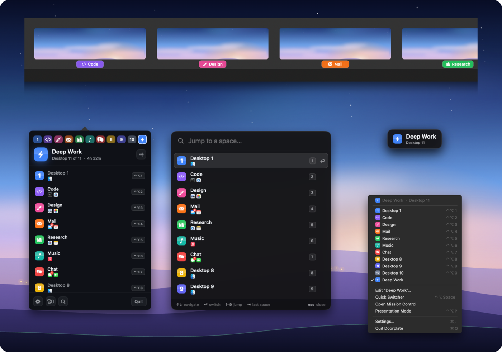

<h1 align="center">Hunter Wolf</h1>

Lifelong developer. Open LLM inference tooling with Local Inference Lab, and the occasional Mac app.

  
  
  
  

<table>
<tr>
<td valign="top" width="55%">

### Local Inference Lab

Proud contributor to [Local Inference Lab](https://github.com/local-inference-lab), a non-profit building open tooling for running large language models on NVIDIA Blackwell hardware. I send patches to the lab's [vLLM fork](https://github.com/local-inference-lab/vllm) and to [b12x](https://github.com/local-inference-lab/b12x), mostly small performance changes in the decode path.

What the lab ships:

- [NVFP4 model builds](https://huggingface.co/local-inference-lab) on Hugging Face, including GLM-5.3-Flash and Qwen3.8-Flash-Next
- A [decode throughput benchmark](https://github.com/local-inference-lab/llm-inference-bench) with a live terminal dashboard
- [Container images](https://github.com/local-inference-lab/blackwell-llm-docker) for vLLM on Blackwell
- The [RTX 6000 Pro wiki](https://github.com/local-inference-lab/rtx6kpro) on running large models on one workstation

</td>
<td valign="top" width="45%">

### Doorplate

Your desktops, with names on the door. Doorplate gives every macOS desktop a name, an icon and a color, and shows it where you look:

- the menu bar, or the notch on a MacBook
- under every thumbnail inside Mission Control, on macOS 14 through 27
- a quick switcher, with the apps open on each desktop
- a tag when you land on a desktop

Native Swift, Apple Silicon and Intel, notarized. One permission, no account, no analytics.

**[doorplate.app](https://doorplate.app)**

</td>
</tr>
</table>
